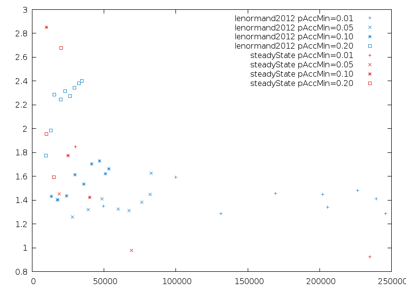

~~~~{.haskell file="formulas/src/L2VSNSimus.hs"}
{-# LANGUAGE OverloadedStrings #-}
{-# LANGUAGE GeneralizedNewtypeDeriving #-}
{-# LANGUAGE NoImplicitPrelude #-}

module L2VSNSimus where

import Protolude 

import qualified Control.Foldl as Fold
import Control.Monad.Random.Lazy
import Data.Functor.Compose
import Data.List (last)
import Data.Text (Text, pack, unpack, unlines, intercalate)
import qualified Data.Vector as V
import Formatting
import System.Random (StdGen, mkStdGen)

import qualified Algorithm
import Figure
import Model
import Run
import Statistics
import qualified ABC.Lenormand2012 as Lenormand2012
import qualified ABC.SteadyState as SteadyState
import Util.Cache as Cache
import qualified Util.SteadyState as SteadyState 
~~~~~~~~

Algorithms need to be run for different values of pAccMin and alpha. We will keep only the final step of each simulation

~~~~ {.haskell file="formulas/src/L2VSNSimus.hs"}
data Algo = Lenormand2012 {getAlpha :: Double, getPAccMin :: Double}
          | SteadyState {getAlpha :: Double, getPAccMin :: Double}
  deriving (Ord, Eq, Show)

type RunC a = Compose (Rand StdGen) Cache a

run :: Algo -> Int -> RunC Run
run Lenormand2012{getAlpha=alpha, getPAccMin=pAccMin} replication = 
     Compose $ liftRandT $ fmap return (runRand (lenormand2012 alpha pAccMin replication))
run SteadyState{getAlpha=alpha, getPAccMin=pAccMin} replication = 
     Compose $ steadyState alpha pAccMin replication

lenormand2012 :: Double -> Double -> Int -> Rand StdGen (Cache Run)
lenormand2012 alpha pAccMin replication =
  let steps :: Rand StdGen [(Int, Lenormand2012.S)]
      steps = zip [1..stepMax]
          <$> Lenormand2012.scan p toyModel 
      algo = Algorithm.Lenormand2012 5000 alpha pAccMin
      p = Lenormand2012.P
        { Lenormand2012.n = Algorithm.getN algo
        , Lenormand2012.nAlpha = floor $ (Algorithm.getAlpha algo) 
                                 * (fromIntegral $ Algorithm.getN algo)
        , Lenormand2012.pAccMin = Algorithm.getPAccMin algo
        , Lenormand2012.priorSample = toyPriorRandomSample
        , Lenormand2012.priorDensity = toyPrior
        , Lenormand2012.distanceToData = rootSquaredError 0 . V.head
        }
      getRun (i, r) = Run 
        { getAlgorithm = algo
        , getStep = i
        , getReplication = replication
        , getSample = Lenormand2012.thetas r }
      cacheRun' = 
        cache' ( unpack $ "output/formulas/param_sampling/run/lenormand2012_"
                             <> sformat (fixed 2) alpha <> "_"
                             <> sformat (fixed 2) pAccMin <> "_"
                             <> show replication )
        . pure
  in do
    g <- getSplit
    return $ cacheRun' . getRun .  last $ evalRand steps g

steadyState :: Double -> Double -> Int -> Rand StdGen (Cache Run)
steadyState alpha pAccMin replication = 
  let steps :: RandT StdGen IO [SteadyState.S]
      steps = SteadyState.scanIndices needSteps ssr
      needSteps = fmap (* 5000) [1..stepMax]
      enumSteps :: RandT StdGen IO [(Int, SteadyState.S)]
      enumSteps = zip needSteps <$> steps
      ssr = SteadyState.runner p model
      model (seed, xs) = return $ evalRand (toyModel xs) (mkStdGen seed)
      algo = Algorithm.SteadyState 5000 alpha pAccMin 1
      p :: SteadyState.P (RandT StdGen IO)
      p = SteadyState.P
        { SteadyState.n = Algorithm.getN algo
        , SteadyState.nAlpha = floor $ (Algorithm.getAlpha algo) * (fromIntegral $ Algorithm.getN algo)
        , SteadyState.pAccMin = Algorithm.getPAccMin algo
        , SteadyState.parallel = Algorithm.getParallel algo
        , SteadyState.priorSample = toyPriorRandomSample
        , SteadyState.priorDensity = toyPrior
        , SteadyState.distanceToData = rootSquaredError 0 . V.head
        }
      getRun (i, r) = Run 
        { getAlgorithm = algo
        , getStep = i
        , getReplication = replication
        , getSample = fmap (SteadyState.getTheta . SteadyState.getSimulation . SteadyState.getReady) (SteadyState.accepteds r) }
      cacheRun' = 
        cache' ( unpack $ "output/formulas/param_sampling/run/steadyState_"
                             <> sformat (fixed 2) alpha <> "_"
                             <> sformat (fixed 2) pAccMin <> "_"
                             <> show replication )
        . Cache.liftIO 
  in do
        g <- getSplit
        return $ cacheRun' $ fmap (getRun . last) $ evalRandT enumSteps g
        
stepMax :: Int
stepMax = 5

rootSquaredError :: Double -> Double -> Double
rootSquaredError expected x = sqrt ((x - expected) ** 2)
~~~~~~~~

Simulations are run for each algorithm and the following values of alpha and pAccMin.

~~~~ {.haskell file="formulas/src/L2VSNSimus.hs"}
samplePAccMin :: [Double]
samplePAccMin = [0.01, 0.05, 0.1, 0.2]
-- samplePAccMin = [0.01]
sampleAlpha :: [Double]
sampleAlpha = [0.1,0.2..0.9]
-- sampleAlpha = [0.1]
~~~~~~~~

For each combination of algorithm and parameter values, replicate simulations.

~~~~ {.haskell file="formulas/src/L2VSNSimus.hs"}
rep :: Algo -> RunC [Run]
rep algo = traverse (\r ->  run algo r) 
               [1..nReplications]

nReplications :: Int
nReplications = 2
~~~~~~~~

Compute L2 and the number of simulation for a run.

~~~~ {.haskell file="formulas/src/L2VSNSimus.hs"}
l2 :: Run -> Double
l2 r = posteriorL2 (-10) 10 300 (toyPosterior 0) sample
  where sample = join $ V.toList $ V.toList <$> getSample r

nsim :: Run -> Int
nsim = nSimus
~~~~~~~~

We will compute average L2 and number of simulation for each algorithm and parameter values (alpha and pAccMin), i.e. over all replications for a given algorithm and parameter.

~~~~ {.haskell file="formulas/src/L2VSNSimus.hs"}
l2Mean :: Fold.Fold Run Double
l2Mean = Fold.premap l2 Fold.mean 
        
nSimMean :: Fold.Fold Run Double
nSimMean = Fold.premap (fromIntegral . nsim) Fold.mean 
~~~~~~~~

Generate the data to plot.

~~~~ {.haskell file="formulas/src/L2VSNSimus.hs"}
data PlotData = PlotData { plotAlpha :: Double
                         , plotPAccMin :: Double
                         , plotNSimus :: Double
                         , plotL2 :: Double}
  deriving (Show)

plotData :: Algo -> RunC PlotData
plotData algo = 
  let nsimusL2 :: RunC (Double, Double)
      nsimusL2 = Fold.fold f <$> rep algo
      f = (,) <$> nSimMean <*> l2Mean
  in uncurry (PlotData (getAlpha algo) (getPAccMin algo)) <$> nsimusL2

dataLenormand2012 :: RunC [[PlotData]] 
dataLenormand2012 = (traverse . traverse) plotData algos
  where algos :: [[Algo]]
        algos = fmap (\p -> Lenormand2012 <$> sampleAlpha <*> pure p)
                     samplePAccMin

dataSteadyState :: RunC [[PlotData]] 
dataSteadyState = (traverse . traverse) plotData algos
  where algos :: [[Algo]]
        algos = fmap (\p -> SteadyState <$> sampleAlpha <*> pure p)
                     samplePAccMin

plotDataToText :: [[PlotData]] -> Text
plotDataToText datasets = 
  let rowTxt (PlotData _ _ nSim l2) = pack $ show nSim ++ " " ++ show l2
      dataSetTxt rows = unlines $ fmap rowTxt rows
  in Data.Text.intercalate "\n\n" $ map dataSetTxt datasets
        
plotL2VSNSim :: RunC ()
plotL2VSNSim =
  let lenPath = "output/formulas/l2VSNSimus/lenormand2012.csv"
      stePath = "output/formulas/l2VSNSimus/steadyState.csv"
  in  (liftC2 (<>)) (sinkTxt lenPath (pure . plotDataToText) `liftC` dataLenormand2012)
      $ (liftC2 (<>)) (sinkTxt stePath (pure . plotDataToText) `liftC` dataSteadyState)
                      (Compose $ return $ gnuplot "report/L2_vs_nsimus.png"
                                    "report/L2_vs_nsimus.gnuplot"
                                    [ ("lenormand2012", lenPath)
                                    , ("steadyState", stePath) ])

liftC :: (Cache a -> Cache b) -> RunC a -> RunC b
liftC f = Compose . liftA f . getCompose

liftC2 :: (Cache a -> Cache b -> Cache c) -> RunC a -> RunC b -> RunC c
liftC2 f a b = Compose $ liftA2 f (getCompose a) (getCompose b)
~~~~~~~~

Build everything we want.

~~~~ {.haskell file="formulas/src/L2VSNSimus.hs"}
buildL2VSNSimus :: Rand StdGen (Cache ())
buildL2VSNSimus = getCompose plotL2VSNSim
~~~~~~~~

