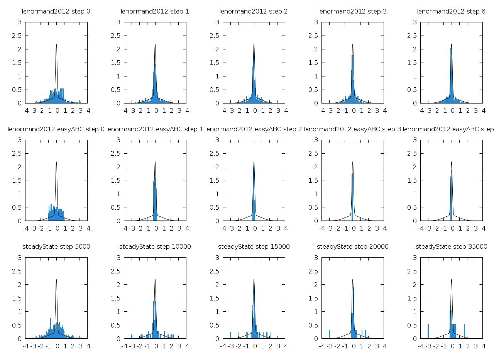

~~~~{.haskell file="formulas/app/Main.hs"}
{-# LANGUAGE OverloadedStrings #-}
{-# LANGUAGE NoImplicitPrelude #-}

import Protolude 

import Control.Monad.Fail (fail)
import Control.Monad.Random (Rand, MonadRandom, evalRand)
import Data.String (String)
import Data.Text (Text, unpack)
import Data.Text.IO (writeFile)
import qualified Data.Vector as V
import System.Random (StdGen, mkStdGen)
-- import Numeric
import System.FilePath (FilePath, (</>))
import System.FilePath.Glob (glob)

import Development.Shake
import Development.Shake.Command
import Development.Shake.FilePath
import Development.Shake.Util

import Formulas
import Input
import Output 
import qualified ABC.Lenormand2012 as Lenormand2012
~~~~~~~~

Run the methods on the toy model.

~~~~ {.haskell file="formulas/app/Main.hs"}
lenormand2012Steps :: [SimulationResult]
lenormand2012Steps = fmap getSimulationResult steps
  where steps = zip [0..] $ take 10 $ evalRand (Lenormand2012.lenormand2012 p toyModel :: Rand StdGen [Lenormand2012.S]) (mkStdGen seed)
        seed = 42
        algo = Lenormand2012 5000 0.1 0.01
        p = Lenormand2012.P
          { Lenormand2012.n = getN algo
          , Lenormand2012.nAlpha = floor $ (getAlpha algo) * (fromIntegral $ getN algo)
          , Lenormand2012.pAccMin = getPAccMin algo
          , Lenormand2012.priorSample = toyPriorRandomSample
          , Lenormand2012.priorDensity = toyPrior
          , Lenormand2012.distanceToData = rootSquaredError 0 . V.head
          }
        getSimulationResult (i, s) = SimulationResult 
          { getAlgorithm = algo
          , getStep = i
          , getReplication = 1
          , getSample = Lenormand2012.thetas s }

-- steadyStateStepsSteps:: [SimulationResult]
-- steadyStateSteps = steps (SteadyState.steadyState toyModel)

rootSquaredError expected x = sqrt ((x - expected) ** 2)
~~~~~~~~

Save each step to the appropriate file.

~~~~ {.haskell file="formulas/app/Main.hs"}
saveSimulationResult :: FilePath -> SimulationResult -> IO ()
saveSimulationResult dir s = writeFile path contents
  where path = (dir </> simulationResultFileName s) 
        contents = (column (V.toList $ fmap V.head $ getSample s))
~~~~~~~~

Create the rule to generate the simulation result files.

~~~~ {.haskell file="formulas/app/Main.hs"}
buildSimulationResult :: FilePath -> SimulationResult -> Rules ()
buildSimulationResult dir s =
  (dir </> simulationResultFileName s) %> \target -> do
    traced "simulation" (saveSimulationResult dir s)

buildLenormand2012Steps = 
  mconcat (fmap (buildSimulationResult "output/formulas/simulationResult/5steps") lenormand2012Steps)
~~~~~~~~

Run the algorithms of Lenormand2012 and Beaumont2009 implemented in the R package easyABC. 

~~~~ {.haskell file="formulas/app/Main.hs"}
buildEasyABCSteps :: Rules ()
buildEasyABCSteps =
  ["output/easyABC/simulationResult/5steps/lenormand2012_5000_0.1_0.01_" <> show i <> "_1.csv" | i <- [0..4]] 
  ++ ["output/easyABC/simulationResult/5steps/beaumont2009_5000_2.00_0.01_" <> show i <> "_1.csv" | i <- [0..4]]
  &%> \targets -> do
    need ["easyABC_Steps.R"]
    cmd_ ("Rscript" :: String) ["easyABC_Steps.R" :: String]
~~~~~~~~

-- Now load them back as simulation results
-- 
-- ~~~~ {.haskell file="formulas/app/Main.hs"}
-- ioEasyABCSteps :: IO [SimulationResult]
-- ioEasyABCSteps = loadAllSimulations "output/easyABC/simulationResult/5steps"
-- ~~~~~~~~

Compute a scaled histogram of a simulation result sample.

~~~~ {.haskell file="formulas/app/Main.hs"}
histogramToy :: SimulationResult -> [(Double, Double)]
histogramToy s = scaledHistogram (-10) 10 300 (V.toList $ fmap V.head $ getSample s)
~~~~~~~~

Compute the histograms for simulation result and save them to the appropriate file.

~~~~ {.haskell file="formulas/app/Main.hs"}
saveHistogramToy :: FilePath -> SimulationResult -> IO ()
saveHistogramToy dir s = writeFile path (columns2 " " histogram)
  where path = dir </> simulationResultFileName s
        histogram = histogramToy s
~~~~~~~~

To create the histogram for a given simulation result file, we need to load the simulation result, compute the histogram and save it to a file.

~~~~ {.haskell file="formulas/app/Main.hs"}
buildHistogram :: FilePath -> FilePath -> Rules ()
buildHistogram targetDir source = do
  es <- liftIO $ loadSimulation source
  case es of
    Left err -> action $ fail $ show err
    Right s ->
      (targetDir </> simulationResultFileName s) %> \target -> do
        need [source]
        traced "histogram" (saveHistogramToy targetDir s)

buildHistograms :: Rules ()
buildHistograms = do
  simFilesSteps <- liftIO $ glob "output/formulas/simulationResult/5steps/*.csv"
  traverse_ (buildHistogram "output/formulas/scaledHistogram/toy") simFilesSteps
  simFilesStepsEasyABC <- liftIO $ glob "output/easyABC/simulationResult/5steps/*.csv"
  traverse_ (buildHistogram "output/easyABC/scaledHistogram/toy") simFilesStepsEasyABC
~~~~~~~~

Generate the figure.

~~~~ {.haskell file="formulas/app/Main.hs"}
buildFigurePosteriorSteps :: Rules ()
buildFigurePosteriorSteps =
  "report/5steps.png" %> \target -> do
    need $ [ "report/5steps.gnuplot" ]
        ++ [ "output/formulas/scaledHistogram/toy/lenormand2012_5000_0.10_0.01_" <> show i <> "_1.csv" | i <- [0..4]]
        ++ [ "output/easyABC/scaledHistogram/toy/lenormand2012_5000_0.10_0.01_" <> show i <> "_1.csv" | i <- [0..4]]
        ++ [ "output/easyABC/scaledHistogram/toy/beaumont2009_5000_2.00_0.01_" <> show i <> "_1.csv" | i <- [0..4]]
    cmd_ (Cwd "report/") (unpack "gnuplot") ([unpack "-c", "5steps.gnuplot"])
~~~~~~~~

~~~~ {.haskell file="formulas/app/Main.hs"}
main :: IO ()
main = shakeArgs shakeOptions{shakeVerbosity=Normal,
                              shakeColor=True} $ do
  want $ ["report/5steps.png"] 
  
  buildLenormand2012Steps
  buildEasyABCSteps
  buildHistograms
  buildFigurePosteriorSteps
~~~~~~~~

